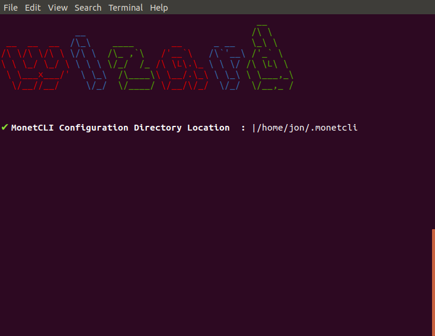
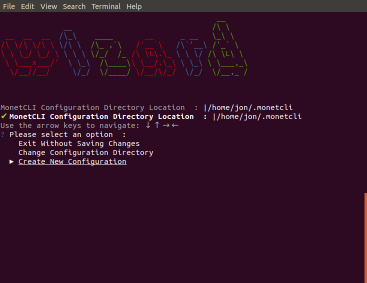
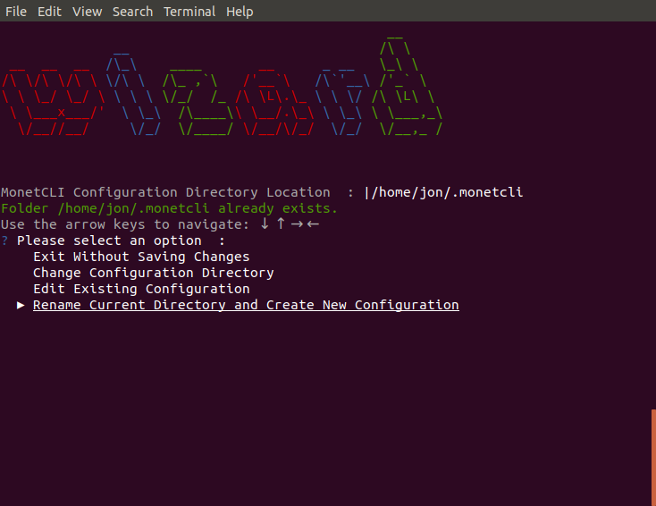
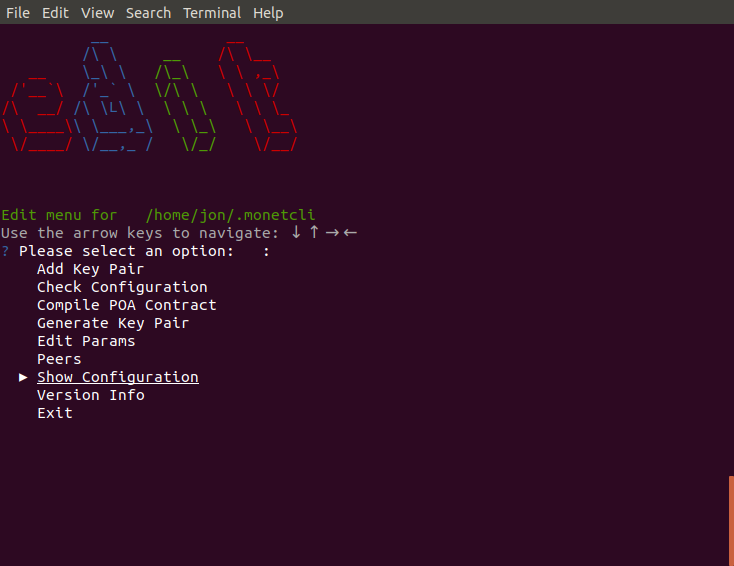
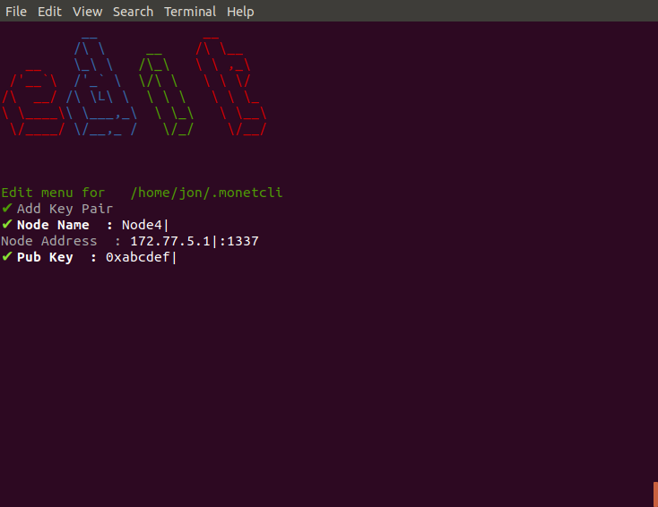
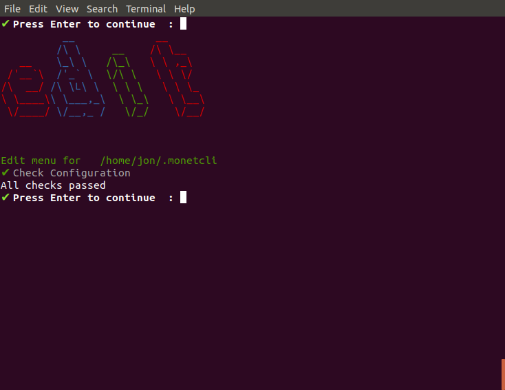
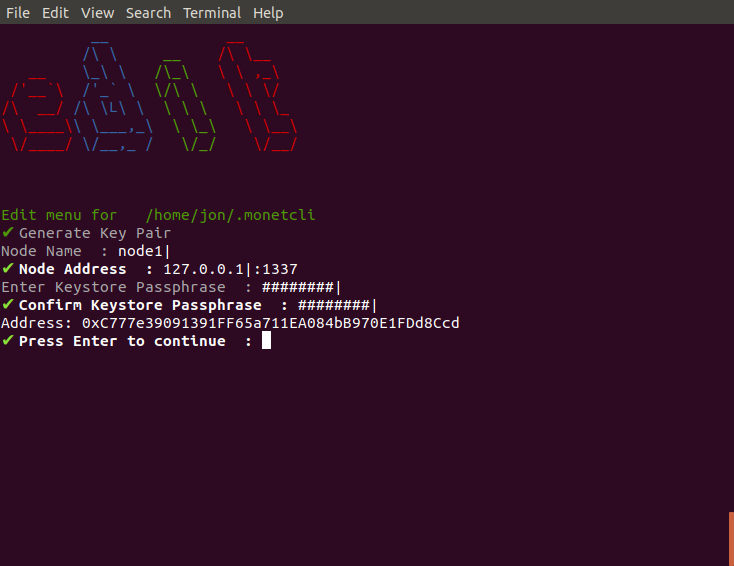
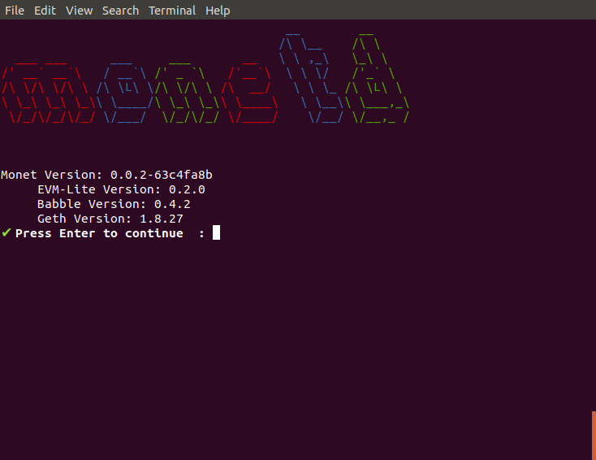

# monetcli wizard

The `monetcli wizard`command is an interactive tool for building a monet network configuration.


----

## Table of Contents


+ [Invocation](#invocation)
	+ [Inputs](#inputs)
+ [Configuration Files](#configuration-files)
	+ [Monetcli Network Configuration Folder](#monetcli-network-configuration-folder)
+ [Edit Menu](#edit-menu)
	+ [Add Key Pair](#add-key-pair)
	+ [Check Configuration](#check-configuration)
	+ [Compile POA Contract](#compile-poa-contract)
	+ [Generate Key Pair](#generate-key-pair)
	+ [Edit Params](#edit-params)
	+ [Peers](#peers)
	+ [Show Configuration](#show-configuration)
	+ [Version Info](#version-info)
	+ [Exit](#exit)

----

# Invocation

The tool can be invoked thus:

```bash
$ monetcli wizard
```

## Inputs

There are 2 main classes of inputs for the wizard subcommand:

+ Typed responses
+ Selection responses

### Typed Responses

As the name suggests these are prompts where you type your answer in as in this example: 

```
✔ MonetCLI Configuration Directory Location  : |/home/jon/.monetcli
```

The tick in the first column denotes that the answer passes verification. You will get a cross if it does not. You can submit an answer by pressing the `Enter` key. The vertical bar character is the cursor - which due to the limitations of the console does not flash. Often a default answer will be prefilled. 

### Selection Responses

For selection responses you use the arrow keys to select a response from a fixed list of responses. The `▸` and underlining denotes the currently selected item. Press the enter key to select a response. 

```
Use the arrow keys to navigate: ↓ ↑ → ← 
? Please select an option  : 
    Exit Without Saving Changes
    Change Configuration Directory
    Edit Existing Configuration
  ▸ Rename Current Directory and Create New Configuration
 
```

# Configuration Files
 
## Monetcli Network Configuration Folder
 
You are prompted to enter the location of the configuration folder to use. Unless there is a pressing reason to change it, we would recommend using the default. If you change the location, future executions of `monetcli` would require a `--config-dir` flag to be set. 
 


The default entry is OS dependent and is set to:

+ **Linux:** 		`$HOME/.monetcli 
+ **Windows:** 	`$HOME/AppData/Roaming/MONET 
+ **Mac:** 		`$HOME/Library/MONET 


If the location does not exist, you get the following 3 options:



You can use the arrow keys to highlight an option, then press `return` to select it. 

+ **Exit Without Saving Changes** --- exits the program
+ **Change Configuration Directory** --- takes you back to the first screen to change your answer
+ **Create New Configuration** --- creates a new configuration in the directory specified
 
In most circumstances you will selection **Create New Configuration**.

If the configuration folder already exists, you will be offered 2 additional options. **Rename Current Directory and Create New Configuration** renames the existing folder with a `.~n~` suffix where `n` is the lowest number where the folder does not already exist. If n reaches 100, the program will abort - and we recommend that you do some housekeeping on your filesystem.  **Edit Existing Configuration** does, as the name suggests, edit the existing configuration in the folder you specified.



**Create New Configuration**, **Rename Current Directory and Create New Configuration** and  **Edit Existing Configuration** all progress to the same menu - the latter with existing configuration, the first 2 with a clean configuration. 

# Edit Menu

The Edit menu allows you to build and amend your network configuration. 




## Add Key Pair
The add key pair option allows the addition of peers whose private key had been generated elsewhere. For testnets you would usually use Generate Key Pair, not Add Key Pair. 




## Check Configuration

This option runs checks to ensure that the `network.toml` is in a consistent state. 



## Compile POA Contract

This option generates an actual monet hub configuration. It implicitly runs a network check command. It populates a datadir directory including copying any keys stored within the network configuration folder. If the nodename is specified the configuration for that node is written. It is intended that the node name would allow multiple configurations be generated from the same machine - likely useful for node. The POA contract is compiled to build the genesis block. If there is no bytecode in the network.toml it is added with solcs version. Otherwise the bytecode is validated. **N.B.** this command requires an internet connection to run, unless you have run `monetcli network contract`. The default contract is downloaded directly from github.

[comment]: # (//TODO Add compile section )

## Generate Key Pair

Generate Key Pair generates a new public and private key pair, and adds it as validator to the monetcli network configuration.



The Node Name, or moniker, is a label used to identify this node. It will be rejected if another node with that name has already been added to this configuration.

The node address is the IP and Port that Babble gossips from. 

The passphrase is used to encrypt your private key to secure it. You will need to re-enter the phrase to confirm it. If the 2 do not match, you will be prompted to enter them again. 

The Address generated is echoed to screen. 

## Edit Params

The Edit Peers interactive command allows you to set the `monetcli` parameters that are pushed to monet hub configuration files. These options are:

+ **Logging level** controls which messages are written to the logs. Select from the list, they are sorted from outputting the most messages to the fewest. 
+ **eth.listen** controls where EVM-Lite listens. The default `:8080` will normally be fine here.
+ **eth.cache** is the size of the EVM-Lite cache 
+ **babble.listen** IP:PORT of Babble node, which must exactly match this node's entry in peers.json
+ **babble.service-listen** IP:PORT of Babble HTTP API service
+ **babble.heartbeat** Heartbeat time milliseconds (time between gossips)
+ **babble.timeout** TCP timeout milliseconds
+ **babble.cache-size** Number of items in LRU caches
+ **babble.sync-limit** Max number of Events per sync
+ **babble.fast-sync** Enable FastSync
+ **babble.max-pool** Max number of pool connections
+ **babble.bootstrap** Bootstrap from Babble database

You have the opportunity to save or discard your changes at the end of the parameter list. Parameters which have mandatory values in the Monet Hub are not available from this sub command.


## Peers

Peers provides an interactive interface for managing peers. You are initially show a list of all peers. You can select one from that list to view its complete details. From there you may edit or delete the peer. Delete does not touch any assoicated keys - it just removes the credentials from the list that is compiled into the peers.json file. Edit Peers allows you to edit / amend each of the stored fields for that node. **N.B.** you will need to use `Generate Key Pair` or `Add Peer` options from the parent menu to add a peer.

[comment]: # (//TODO Add peers section )

## Show Configuration

This option echoes the current `network.toml` file to screen. 


## Version Info

The version info command displays version information. 





## Exit

The exit command closes the program. 

----


----

<sup>[Documents Index](README.md) | [GitHub repo](https://github.com/mosaicnetworks/monetd) | [Monet](https://monet.network/) | [Mosaic Networks](https://www.babble.io/)</sup>
